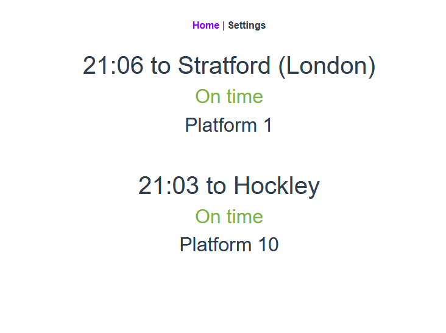

<!-- PROJECT SHIELDS -->
<!--
*** I'm using markdown "reference style" links for readability.
*** Reference links are enclosed in brackets [ ] instead of parentheses ( ).
*** See the bottom of this document for the declaration of the reference variables
*** for contributors-url, forks-url, etc. This is an optional, concise syntax you may use.
*** https://www.markdownguide.org/basic-syntax/#reference-style-links
-->
[![Issues][issues-shield]][issues-url]
[![MIT License][license-shield]][license-url]


<!-- PROJECT LOGO -->
<br />
<p align="center">
  <a>
    
  </a>

  <h3 align="center">Commute Status Web App</h3>

  <p align="center">
    Commute Status a simple Web and Android app to quickly see the status of your commute.
    <br />
    <br />
    <a href="https://commutestatus.suskins.co.uk">Check it out!</a>
    ·
    <a href="https://github.com/BenSuskins/commutestatus-web-app/issues">Report Bug</a>
    ·
    <a href="https://github.com/BenSuskins/commutestatus-web-app/issues">Request Feature</a>
  </p>
</p>


<!-- TABLE OF CONTENTS -->
## Table of Contents

* [About the Project](#about-the-project)
  * [Built With](#built-with)
* [Getting Started](#getting-started)
  * [Prerequisites](#prerequisites)
  * [Installation](#installation)
* [Contributing](#contributing)
* [License](#license)
* [Contact](#contact)

<!-- ABOUT THE PROJECT -->
## About The Project



Commute Status is a simple Web and Android app to quickly and easily see the status of your commute.

Check out the [Android App](https://github.com/BenSuskins/commutestatus-android-app).


### Built With

* Vue.js
* Bootstrap Vue
* Auth0


<!-- GETTING STARTED -->
## Getting Started
Create an Auth0 account and configure the [auth_config.json](auth_config.json).

To run the backend check out: [Commute Status API](https://github.com/BenSuskins/commutestatus-api).

### Project setup
```
npm install
```

### Compiles and hot-reloads for development
```
npm run serve
```

### Compiles and minifies for production
```
npm run build
```

### Lints and fixes files
```
npm run lint
```

<!-- CONTRIBUTING -->
## Contributing

Contributions are what make the open source community such an amazing place to be learn, inspire, and create. Any contributions you make are **greatly appreciated**.

1. Fork the Project
2. Create your Feature Branch (`git checkout -b feature/AmazingFeature`)
3. Commit your Changes (`git commit -m 'Add some AmazingFeature'`)
4. Push to the Branch (`git push origin feature/AmazingFeature`)
5. Open a Pull Request


<!-- LICENSE -->
## License

Distributed under the MIT License. See `LICENSE` for more information.


<!-- CONTACT -->
## Contact

Ben Suskins - [@BenSuskins](https://twitter.com/BenSuskins) - suskinsdevelopment@gmail.com

Project Link: [Commute Status Web App](https://github.com/BenSuskins/commutestatus-web-app)

<!-- MARKDOWN LINKS & IMAGES -->
<!-- https://www.markdownguide.org/basic-syntax/#reference-style-links -->
[issues-shield]: https://img.shields.io/badge/Issues-0-brightgreen
[issues-url]: https://github.com/BenSuskins/commutestatus-web-app/issues
[license-shield]: https://img.shields.io/badge/License-MIT-brightgreen
[license-url]: https://github.com/BenSuskins/commutestatus-web-app/blob/master/LICENSE.txt
[product-screenshot]: images/screenshot.png
